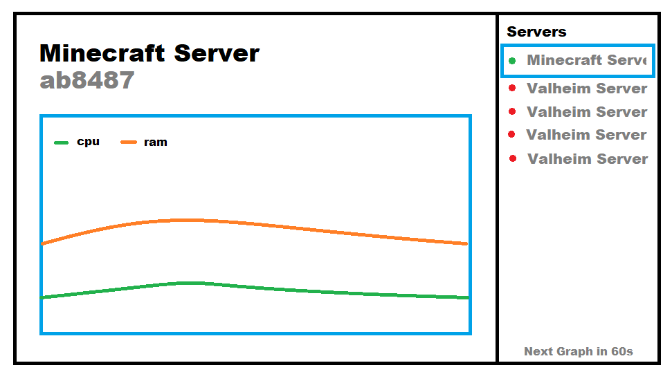
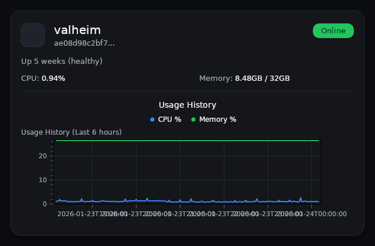
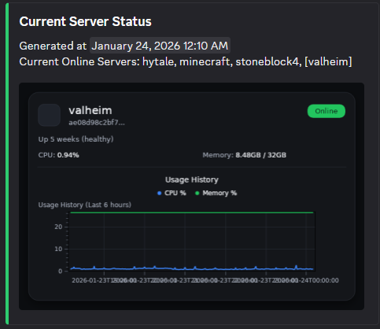

# server-compose

A simple single .net core web api server that serves a single asset image that renders a style similar to my monitoring website, this updates a discord message ever x intervals to refresh and break the cache. Allows external network users to see statuses without exposing a api

Example usage:  

  
Actual rendered image:  

What the actual webhook message looks like:  

## personal notes

Dev work:

dotnet restore
dotnet run

If you want hot reload:

dotnet watch run

Deploying:

## Must be done if updating ENVs

docker compose up -d --build --force-recreate
